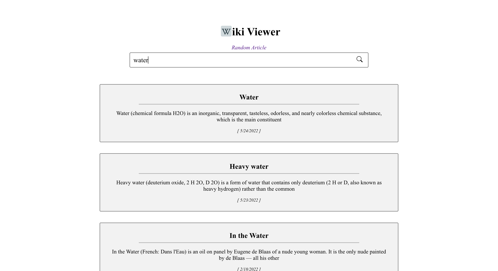

## Wiki Viewer App

An application that allows the user to search for a term and retrieve 10 relevant wikipedia articles, built with React, Express, JavaScript, and CSS.

## Screen Shots(s)

## Installation and Setup Instructions

Clone this repository (You will need `node` and `npm` installed globally on your machine)

Installation:

`npm install` 
`cd client` 
`npm install`

To Start Server:

`npm start`

To Start Client:

`(Open new console tab)` 
`cd client` 
`npm start`

To Visit App:

`localhost:3000`

## Summary

- Application features:
    - Search for a term and retrieve 10 relevant wikipedia articles
- What was the purpose of this project?
    - Practicing full-stack development using React for the frontend and Express for the backend
    - Deploying a React/Express app to Heroku
    - Creating a basic app using container & presentational components
    - Making a basic API request